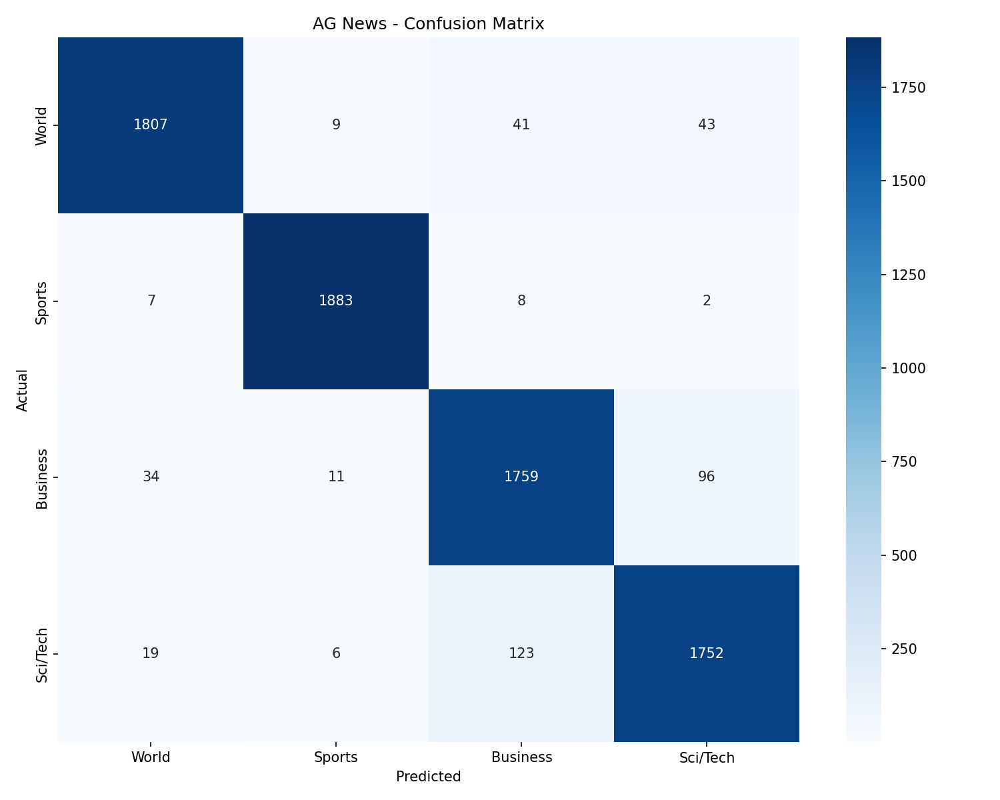
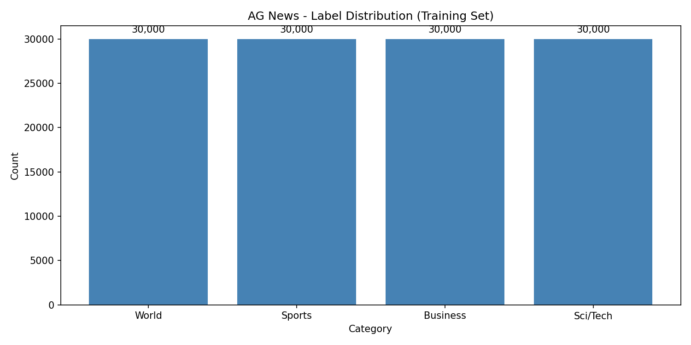
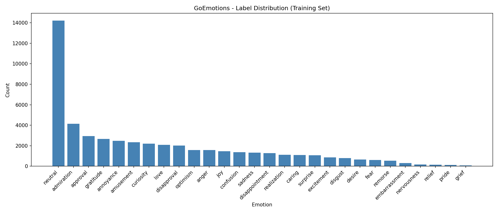
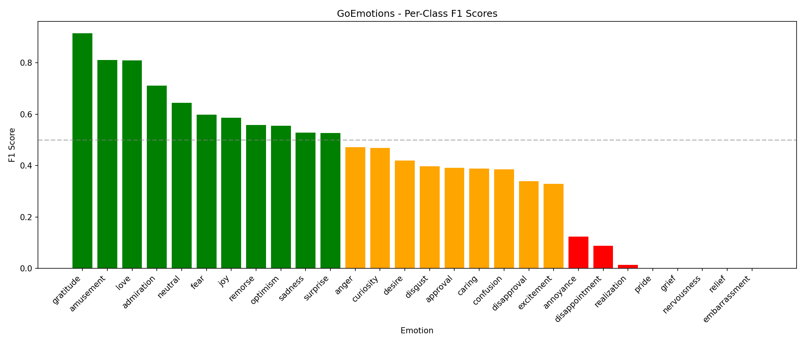

# 📊 Reports - Fine-tuning BERT for Text Classification

<div align="center">

**Dokumentasi lengkap hasil eksperimen fine-tuning BERT untuk AG News dan GoEmotions**

[📰 AG News Report](#-ag-news-report) • [😊 GoEmotions Report](#-goemotions-report) • [📈 Visualizations](#-visualizations)

</div>

---

## 📋 Overview

Direktori ini berisi **laporan eksperimen** dan **visualisasi** dari fine-tuning BERT untuk dua task text classification:

| Report | Dataset | Task Type | Best Metric | Status |
|--------|---------|-----------|-------------|--------|
| 📰 AG News | sh0416/ag_news | Multi-class (4 classes) | **94.75% Accuracy** | ✅ Complete |
| 😊 GoEmotions | google-research-datasets/go_emotions | Multi-label (28 classes) | **57.49% Micro-F1** | ✅ Complete |

---

## 📁 Directory Structure

```
reports/
│
├── 📄 README.md                                    # This file
│
├── 📂 reports-ag-news/                             # AG News Experiment
│   ├── 📄 report_ag_news.md                       # Detailed experiment report
│   ├── 🖼️ agnews_confusion_matrix.png             # Confusion matrix visualization
│   └── 🖼️ agnews_label_distribution.png           # Label distribution chart
│
└── 📂 reports-go-emotions/                         # GoEmotions Experiment
    ├── 📄 report_go_emotions.md                   # Detailed experiment report
    ├── 🖼️ goemotions_label_distribution.png       # Label distribution chart
    └── 🖼️ goemotions_per_class_f1.png             # Per-class F1 score chart
```

---

## 📰 AG News Report

### Quick Summary

| Metric | Validation | Test |
|--------|------------|------|
| **Loss** | 0.1790 | 0.1832 |
| **Accuracy** | 94.83% | **94.75%** |
| **Macro-F1** | 94.81% | **94.76%** |

### Per-Class Performance

| Class | Precision | Recall | F1-Score | Status |
|-------|-----------|--------|----------|--------|
| 🌍 World | 96.79% | 95.11% | 95.94% | 🟢 Excellent |
| ⚽ Sports | 98.64% | 99.11% | **98.87%** | 🟢 Best |
| 💼 Business | 91.09% | 92.58% | 91.83% | 🟡 Good |
| 🔬 Sci/Tech | 92.55% | 92.21% | 92.38% | 🟡 Good |

### Visualizations

| File | Description |
|------|-------------|
| `agnews_confusion_matrix.png` | 4x4 confusion matrix showing prediction vs actual |
| `agnews_label_distribution.png` | Bar chart of label distribution in dataset |

### Key Findings

1. ✅ **Exceeds BERT benchmark** (94.75% vs 94.2%)
2. ✅ **Sports easiest** to classify (distinctive vocabulary)
3. ⚠️ **Business ↔ Sci/Tech** sometimes confused (tech company news)
4. ✅ **No overfitting** (val ≈ test performance)

📄 **Full Report:** [report_ag_news.md](reports-ag-news/report_ag_news.md)

---

## 😊 GoEmotions Report

### Quick Summary

| Metric | Validation | Test |
|--------|------------|------|
| **Loss** | 0.0857 | 0.0847 |
| **Micro-F1** | 57.43% | **57.49%** |
| **Macro-F1** | 39.91% | **39.50%** |

### Performance Tiers

| Tier | F1 Range | Emotions |
|------|----------|----------|
| 🟢 **Excellent** | 70-92% | gratitude (91.5%), amusement (81.0%), love (80.9%), admiration (71.1%) |
| 🟡 **Good** | 50-70% | neutral, fear, joy, remorse, optimism, sadness, surprise |
| 🟠 **Moderate** | 30-50% | anger, curiosity, desire, disgust, approval, caring, confusion |
| 🔴 **Poor** | 1-30% | annoyance (12.4%), disappointment (8.8%), realization (1.4%) |
| ⚫ **Zero** | 0% | embarrassment, grief, nervousness, pride, relief ⚠️ |

### Visualizations

| File | Description |
|------|-------------|
| `goemotions_label_distribution.png` | Bar chart showing severe class imbalance |
| `goemotions_per_class_f1.png` | F1 scores for all 28 emotion classes |

### Key Findings

1. ✅ **Matches benchmark Micro-F1** (57.49% vs 58.0%)
2. ⚠️ **5 emotions never predicted** (F1 = 0%) due to severe class imbalance
3. ✅ **Best on clear emotions** (gratitude, love, amusement)
4. ⚠️ **Macro-F1 low** (39.5%) pulled down by rare classes

📄 **Full Report:** [report_go_emotions.md](reports-go-emotions/report_go_emotions.md)

---

## 📈 Visualizations

### AG News Visualizations

#### Confusion Matrix


**Interpretation:**
- Diagonal = correct predictions (darker = more)
- Off-diagonal = misclassifications
- Business ↔ Sci/Tech shows most confusion

#### Label Distribution


**Interpretation:**
- Perfectly balanced dataset (25% each class)
- No class imbalance issues

---

### GoEmotions Visualizations

#### Label Distribution


**Interpretation:**
- Severe class imbalance (300:1 ratio)
- `neutral` dominates, `grief` extremely rare
- Imbalance causes 5 classes with F1 = 0%

#### Per-Class F1 Scores


**Interpretation:**
- Wide performance gap (0% to 91.5%)
- Top performers: gratitude, amusement, love
- Bottom performers: rare emotions (grief, pride, relief)

---

## 📊 Comparison: AG News vs GoEmotions

| Aspect | AG News | GoEmotions |
|--------|---------|------------|
| **Task Type** | Multi-class | Multi-label |
| **Classes** | 4 | 28 |
| **Class Balance** | ✅ Perfectly balanced | ⚠️ Severely imbalanced |
| **Best Metric** | 94.75% Accuracy | 57.49% Micro-F1 |
| **Difficulty** | ⭐⭐ Medium | ⭐⭐⭐⭐ Hard |
| **Loss Function** | CrossEntropyLoss | BCEWithLogitsLoss |
| **Prediction** | argmax | sigmoid > 0.5 |
| **Labels/Sample** | Exactly 1 | 0 to many |

---

## 🔗 Quick Links

| Document | Description |
|----------|-------------|
| [📰 AG News Full Report](reports-ag-news/report_ag_news.md) | Complete analysis, methodology, results |
| [😊 GoEmotions Full Report](reports-go-emotions/report_go_emotions.md) | Multi-label analysis, class imbalance |
| [🖼️ AG News Confusion Matrix](reports-ag-news/agnews_confusion_matrix.png) | Visual prediction analysis |
| [🖼️ GoEmotions F1 Chart](reports-go-emotions/goemotions_per_class_f1.png) | Per-class performance |

---

## 📚 Report Contents

Each report includes:

| Section | Description |
|---------|-------------|
| **Overview** | Task description, model, dataset info |
| **Dataset Description** | Labels, splits, class distribution |
| **Methodology** | Preprocessing, tokenization, training config |
| **Results** | Validation/test metrics, per-class performance |
| **Analysis** | Confusion matrix, error analysis, key findings |
| **Inference Examples** | Sample predictions with confidence |
| **Saved Artifacts** | Model and visualization locations |
| **Benchmarks** | Comparison with published results |
| **Conclusion** | Achievements, limitations, takeaways |

---

## 🛠️ How Reports Were Generated

Reports were generated from training notebooks with:

```python
# Metrics from Trainer evaluation
metrics = trainer.evaluate(eval_dataset=test_dataset)

# Classification report
from sklearn.metrics import classification_report, confusion_matrix
print(classification_report(y_true, y_pred, target_names=LABEL_NAMES))

# Visualizations saved with matplotlib
plt.savefig(REPORTS_DIR / 'confusion_matrix.png', dpi=150)
```

---

## 📝 Notes

- All visualizations saved at **150 DPI** for clarity
- Reports written in **Markdown** for GitHub compatibility
- Metrics computed on **test set** for final results
- Training conducted on **Google Colab** with Tesla T4 GPU

---

<div align="center">

**Part of UAS Deep Learning - Task 1**

📁 Parent: `finetuning-bert-text-classification/`

</div>
