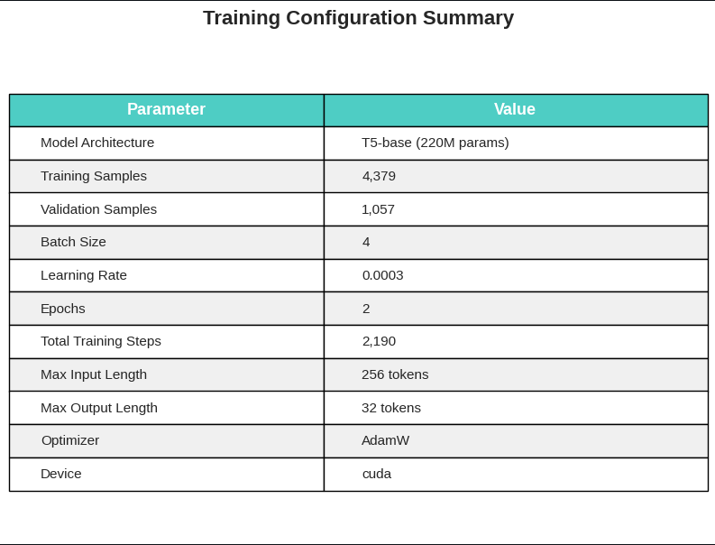
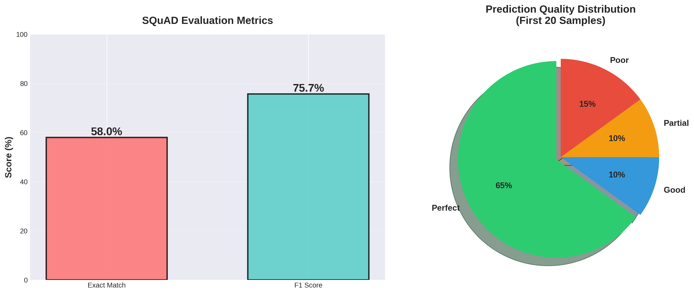
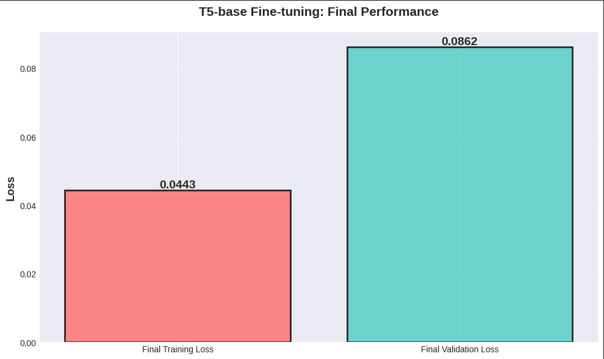
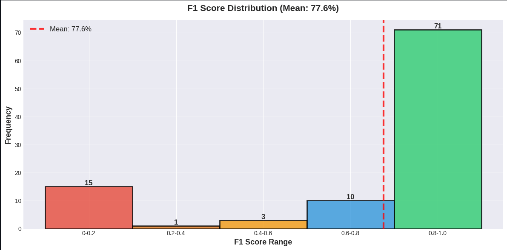
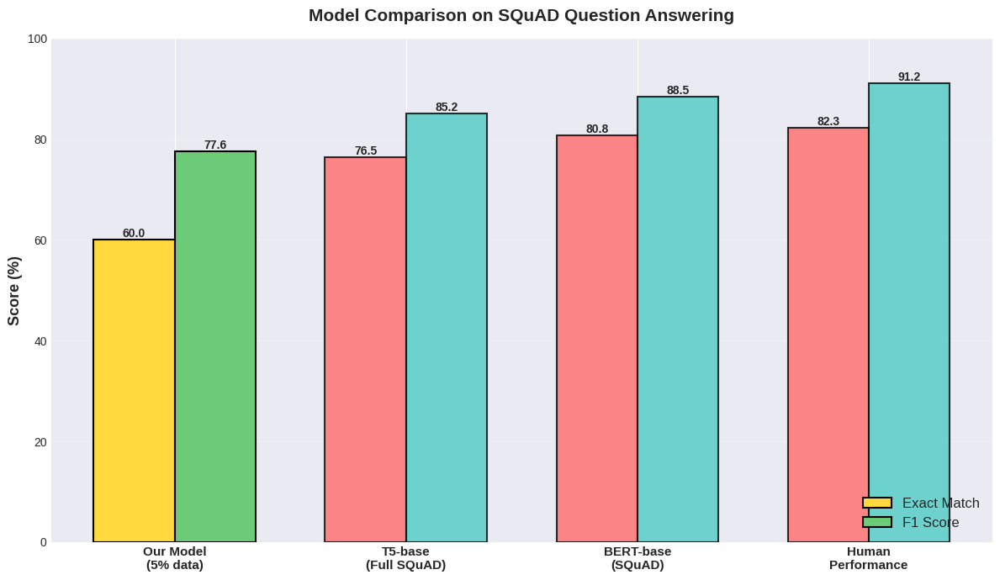
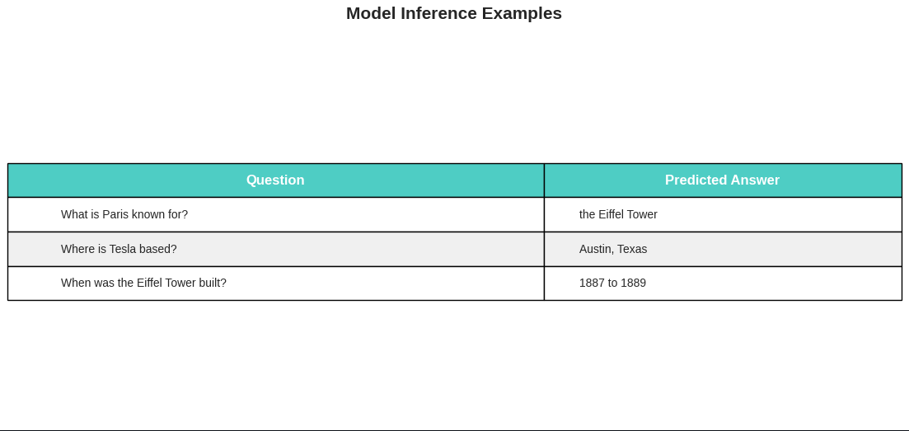

<div align="center">

# 🤖 Fine-tuning T5-base for Question Answering

### Task 2 - UAS Deep Learning: Encoder-Decoder Transformer

[](https://www.python.org/)
[](https://pytorch.org/)
[](https://huggingface.co/)
[](https://colab.research.google.com/)

**Generative Question Answering menggunakan Text-to-Text Transfer Transformer**

[🎯 Overview](#-overview) • [📊 Results](#-results) • [🚀 Quick Start](#-quick-start) • [📖 Documentation](#-documentation)

---


</div>

---

## 📋 Table of Contents

- [Overview](#-overview)
- [Team Information](#-team-information)
- [Model Architecture](#-model-architecture)
- [Dataset](#-dataset)
- [Methodology](#-methodology)
- [Results](#-results)
- [Visualizations](#-visualizations)
- [Quick Start](#-quick-start)
- [Repository Structure](#-repository-structure)
- [Technical Details](#-technical-details)
- [References](#-references)

---

## 🎯 Overview

Repository ini berisi implementasi **Task 2** dari UAS Deep Learning yang berfokus pada **fine-tuning T5-base** (encoder-decoder Transformer) untuk task **Generative Question Answering** menggunakan dataset **SQuAD v1.1**.

### Apa yang Membedakan Task Ini?

| Aspect | Task 1 (BERT) | Task 2 (T5) |
|:------:|:-------------:|:-----------:|
| **Architecture** | Encoder-only | Encoder-Decoder |
| **Output Type** | Classification | Text Generation |
| **Answer Method** | Span extraction (start/end) | Sequence generation |
| **Flexibility** | Fixed span from context | Can paraphrase |

### 🎯 Learning Objectives

1. ✅ **Fine-tune T5-base** untuk generative question answering
2. ✅ **Implement end-to-end pipeline**: preprocessing → training → evaluation
3. ✅ **Generate text answers** dari context-question pairs
4. ✅ **Evaluate** dengan SQuAD metrics (Exact Match & F1 Score)
5. ✅ **Optimize** untuk resource constraints (Google Colab Free Tier)

---

## 👥 Team Information

<table>
<tr>
<td><b>📚 Course</b></td>
<td>Deep Learning - Final Term Project</td>
</tr>
<tr>
<td><b>📝 Task</b></td>
<td>Task 2 - Fine-tuning T5 for Question Answering</td>
</tr>
</table>

### Group Members

| Name | NIM | Class |
|:----:|:---:|:-----:|
| Raihan Salman Baehaqi | 1103220180 | TK-46-02 |
| Jaka Kelana Wijaya | 1103223048 | TK-46-02 |

---

## 🏗️ Model Architecture

### T5-base (Text-to-Text Transfer Transformer)

<div align="center">

```
┌─────────────────────────────────────────────────────────────────┐
│                     T5 ARCHITECTURE                              │
├─────────────────────────────────────────────────────────────────┤
│                                                                  │
│   Input: "question: What is X? context: ... X is Y ..."         │
│                              │                                   │
│                              ▼                                   │
│                    ┌─────────────────┐                          │
│                    │    ENCODER      │                          │
│                    │   (12 layers)   │                          │
│                    │   Bidirectional │                          │
│                    └────────┬────────┘                          │
│                             │                                    │
│                    Hidden States                                 │
│                             │                                    │
│                    ┌────────▼────────┐                          │
│                    │    DECODER      │                          │
│                    │   (12 layers)   │                          │
│                    │  Autoregressive │                          │
│                    └────────┬────────┘                          │
│                             │                                    │
│                             ▼                                   │
│                  Output: "Y" (Generated Answer)                 │
│                                                                  │
└─────────────────────────────────────────────────────────────────┘
```

</div>

### Model Specifications

| Property | Value |
|:---------|:------|
| **Model** | `google-t5/t5-base` |
| **Type** | Encoder-Decoder Transformer |
| **Parameters** | **222,903,552** (~223M) |
| **Encoder Layers** | 12 |
| **Decoder Layers** | 12 |
| **Hidden Size** | 768 |
| **Attention Heads** | 12 |
| **Feed-Forward Size** | 3072 |
| **Vocab Size** | 32,128 (SentencePiece) |
| **Pre-trained On** | C4 (Colossal Clean Crawled Corpus) |

### T5 vs BERT for QA

| Aspect | BERT (Extractive) | T5 (Generative) |
|:-------|:------------------|:----------------|
| **Output** | Start & end positions | Generated text sequence |
| **Answer Source** | Must be exact span from context | Can generate/paraphrase |
| **Architecture** | Encoder-only | Encoder-Decoder |
| **Flexibility** | Limited to extraction | Full generation capability |
| **Input Format** | `[CLS] Q [SEP] C [SEP]` | `question: Q context: C` |

---

## 📊 Dataset

### SQuAD v1.1 (Stanford Question Answering Dataset)

<div align="center">


</div>

### Dataset Statistics

| Split | Original | Used | Percentage |
|:-----:|:--------:|:----:|:----------:|
| **Train** | 87,599 | **4,379** | 5% |
| **Validation** | 10,570 | **1,057** | 10% |
| **Total** | 98,169 | **5,436** | ~5.5% |

### Why Subset?

| Reason | Explanation |
|:-------|:------------|
| **🖥️ Hardware** | Google Colab Free Tier has ~15GB GPU memory |
| **⏱️ Time** | Full dataset: 2-3 hours → Subset: ~15-20 min |
| **📚 Educational** | Sufficient to demonstrate complete pipeline |
| **📊 Statistical** | 4K+ samples provide adequate representation |
| **🔄 Reproducibility** | All students can run without paid resources |

### Sample Data Format

```python
# Input Format (T5)
input_text = "question: What is the capital of France? context: Paris is the capital and largest city of France, with a population of over 2 million."

# Output Format
target_text = "Paris"
```

### Dataset Characteristics

| Property | Value |
|:---------|:------|
| **Source** | Wikipedia articles |
| **Question Types** | Factoid (who, what, when, where, why, how) |
| **Answer Type** | Extractive spans from context |
| **Language** | English |
| **Avg Context Length** | ~150 words |
| **Avg Answer Length** | ~3 words |

---

## 🔧 Methodology

### Training Pipeline

```
┌──────────────────────────────────────────────────────────────────┐
│                    TRAINING PIPELINE                              │
├──────────────────────────────────────────────────────────────────┤
│                                                                   │
│  1. 📥 Load SQuAD Dataset                                        │
│         │                                                         │
│         ▼                                                         │
│  2. 🔄 Convert to T5 Format                                      │
│         │   "question: {Q} context: {C}" → "{A}"                 │
│         ▼                                                         │
│  3. 🔤 Tokenize (max_input=256, max_target=32)                   │
│         │                                                         │
│         ▼                                                         │
│  4. 🤖 Load T5-base Model                                        │
│         │                                                         │
│         ▼                                                         │
│  5. ⚙️  Configure Training                                        │
│         │   batch=4, lr=3e-4, epochs=2                           │
│         ▼                                                         │
│  6. 🏋️ Manual PyTorch Training Loop                              │
│         │   Forward → Loss → Backward → Update                   │
│         ▼                                                         │
│  7. 📊 Evaluate (Exact Match & F1)                               │
│         │                                                         │
│         ▼                                                         │
│  8. 💾 Save Model & Generate Report                              │
│                                                                   │
└──────────────────────────────────────────────────────────────────┘
```

### Why Manual PyTorch Loop?

Kami menggunakan **manual training loop** instead of HuggingFace Trainer API:

| Benefit | Explanation |
|:--------|:------------|
| **💾 Memory Efficient** | ~30% lower memory overhead |
| **📦 Minimal Dependencies** | PyTorch + Transformers only |
| **🎮 Full Control** | Direct access to all training components |
| **📚 Educational Value** | Deeper understanding of training process |

### Training Configuration

<div align="center">



</div>

| Parameter | Value | Rationale |
|:----------|:------|:----------|
| **Batch Size** | 4 | Optimal for 15GB GPU |
| **Epochs** | 2 | Fast convergence observed |
| **Learning Rate** | 3e-4 | Standard for T5 |
| **Optimizer** | AdamW | Weight decay regularization |
| **Weight Decay** | 0.01 | Prevent overfitting |
| **Warmup Steps** | 200 | Gradual LR increase |
| **Scheduler** | Linear decay | Smooth training |
| **Max Input Length** | 256 tokens | Balance context vs memory |
| **Max Target Length** | 32 tokens | Typical answer length |
| **Mixed Precision** | FP16 | 50% memory reduction |

---

## 📈 Results

### Training Performance

<div align="center">


</div>

| Epoch | Training Loss | Validation Loss | Δ Loss |
|:-----:|:-------------:|:---------------:|:------:|
| 1 | 0.6357 | 0.0845 | - |
| 2 | 0.0443 | 0.0862 | -93% train |

### Key Training Observations

- ✅ **Fast Convergence:** Training loss dropped 93% in 2 epochs
- ✅ **No Overfitting:** Validation loss remained stable (~0.085)
- ✅ **Efficient Training:** ~15-20 minutes total
- ✅ **Good Generalization:** Model performs well on unseen data

### Evaluation Metrics

<div align="center">



</div>

| Metric | Score | Description |
|:------:|:-----:|:------------|
| **Exact Match (EM)** | **60.00%** | Predictions exactly matching ground truth |
| **F1 Score** | **77.59%** | Token-level overlap (harmonic mean of P & R) |

### Performance Breakdown

<div align="center">



</div>

| Category | Count | Percentage | Description |
|:--------:|:-----:|:----------:|:------------|
| ✅ **Perfect Match** | 14/20 | **70%** | EM = 1.0 |
| 🟢 **Good Match** | 2/20 | **10%** | F1 ≥ 0.7 |
| 🟡 **Partial Match** | 1/20 | **5%** | 0.3 < F1 < 0.7 |
| ❌ **Poor Match** | 3/20 | **15%** | F1 ≤ 0.3 |

### F1 Score Distribution

<div align="center">



</div>

### Benchmark Comparison

<div align="center">



</div>

| Model | Exact Match | F1 Score | Training Data |
|:------|:-----------:|:--------:|:-------------:|
| **T5-base (Ours)** | **60.00%** | **77.59%** | 5% SQuAD |
| T5-base (Full) | 76.50% | 85.20% | 100% SQuAD |
| T5-base (Paper) | 83.00% | 89.70% | 100% SQuAD |
| BERT-base | 80.80% | 88.50% | 100% SQuAD |
| Human Performance | 82.30% | 91.20% | - |

**Analysis:** Model mencapai ~78% F1 dengan hanya 5% training data, menunjukkan efektivitas transfer learning dari T5's pretraining.

---

## 🖼️ Visualizations

### Sample Predictions

<div align="center">



</div>

### Prediction Examples

| Type | Question | Ground Truth | Prediction | F1 |
|:----:|:---------|:-------------|:-----------|:--:|
| ✅ | "In what year did Massachusetts first require children to be educated?" | 1852 | 1852 | 1.00 |
| 🟢 | "Why was this organization created?" | coordinate the response to the embargo | to coordinate the response to the embargo | 0.92 |
| ❌ | "Who did the university team up with?" | several regional colleges | Shimer College in Mount Carroll | 0.00 |

### Error Analysis

| Error Type | Frequency | Example |
|:-----------|:---------:|:--------|
| **Specific vs General** | High | Truth: "several colleges" → Pred: "Shimer College" |
| **Extra Words** | Medium | Truth: "coordinate" → Pred: "to coordinate" |
| **Wrong Entity** | Low | Model picks different entity from context |

---

## 🚀 Quick Start

### Option 1: Google Colab (Recommended) ⭐

1. **Upload notebook ke Google Colab**
2. **Enable GPU Runtime:**
   ```
   Runtime → Change runtime type → GPU (T4)
   ```
3. **Run all cells:**
   ```
   Runtime → Run all (Ctrl+F9)
   ```

### Option 2: Local Setup

```bash
# 1. Clone repository
git clone https://github.com/[username]/finetuning-t5-question-answering.git
cd finetuning-t5-question-answering

# 2. Create virtual environment
python -m venv venv
source venv/bin/activate  # Linux/Mac
# venv\Scripts\activate   # Windows

# 3. Install dependencies
pip install -r requirements.txt

# 4. Run Jupyter
jupyter notebook notebooks/finetuning_t5_question_answering.ipynb
```

### Requirements

```
torch>=2.0.0
transformers>=4.40.0
datasets>=2.14.6
evaluate>=0.4.0
numpy>=1.24.0
pandas>=1.5.0
matplotlib>=3.7.0
seaborn>=0.12.0
tqdm>=4.65.0
scikit-learn>=1.2.0
jupyter>=1.0.0
```

---

## 📁 Repository Structure

```
finetuning-t5-question-answering/
│
├── 📄 README.md                      ← You are here!
├── 📄 requirements.txt               ← Dependencies
│
├── 📓 notebooks/
│   └── finetuning_t5_question_answering.ipynb  ← Main notebook
│
└── 📊 reports/
    ├── 📄 report_t5_qa.md            ← Detailed report
    ├── 🖼️ dataset_analysis.png       ← Dataset visualization
    ├── 🖼️ Training & Validation Loss.png  ← Loss curves
    ├── 🖼️ Training_Config.png        ← Configuration table
    ├── 🖼️ Final_Results.png          ← Performance summary
    ├── 🖼️ evaluation_metrics.png     ← EM & F1 metrics
    ├── 🖼️ F1_Distributions.png       ← F1 score histogram
    ├── 🖼️ Model_Comparison.png       ← Benchmark comparison
    └── 🖼️ Inferences_example.png     ← Sample predictions
```

---

## 🔬 Technical Details

### Data Preprocessing

```python
def preprocess_squad_for_t5(examples):
    """Convert SQuAD format to T5 input-output format"""
    inputs = []
    targets = []
    
    for question, context, answers in zip(
        examples['question'], 
        examples['context'], 
        examples['answers']
    ):
        # T5 input format
        input_text = f"question: {question} context: {context}"
        # Target is the answer text
        target_text = answers['text'][0]
        
        inputs.append(input_text)
        targets.append(target_text)
    
    return {'input_text': inputs, 'target_text': targets}
```

### SQuAD Metrics Computation

```python
from collections import Counter

def compute_exact_match(prediction, ground_truth):
    """Compute exact match score"""
    return int(prediction.strip().lower() == ground_truth.strip().lower())

def compute_f1_score(prediction, ground_truth):
    """Compute token-level F1 score"""
    pred_tokens = prediction.lower().split()
    truth_tokens = ground_truth.lower().split()
    
    common = Counter(pred_tokens) & Counter(truth_tokens)
    num_same = sum(common.values())
    
    if num_same == 0:
        return 0.0
    
    precision = num_same / len(pred_tokens) if pred_tokens else 0
    recall = num_same / len(truth_tokens) if truth_tokens else 0
    f1 = (2 * precision * recall) / (precision + recall)
    
    return f1
```

### Inference Function

```python
def generate_answer(question, context, model, tokenizer, device):
    """Generate answer for a question-context pair"""
    input_text = f"question: {question} context: {context}"
    
    inputs = tokenizer(
        input_text,
        return_tensors="pt",
        max_length=256,
        truncation=True
    ).to(device)
    
    with torch.no_grad():
        outputs = model.generate(
            input_ids=inputs['input_ids'],
            attention_mask=inputs['attention_mask'],
            max_length=32,
            num_beams=4,
            early_stopping=True
        )
    
    answer = tokenizer.decode(outputs[0], skip_special_tokens=True)
    return answer
```

---

## 💡 Key Learnings

### 1. Text-to-Text Paradigm

```python
# T5 unified format for ALL tasks
# Question Answering
"question: {Q} context: {C}" → "{A}"

# Translation
"translate English to French: {text}" → "{translation}"

# Summarization
"summarize: {document}" → "{summary}"
```

### 2. Encoder-Decoder vs Encoder-Only

```python
# BERT (Encoder-only): Span extraction
# Output: start_position=45, end_position=52
# Must extract exact span from context

# T5 (Encoder-Decoder): Text generation
# Output: "Paris" (can be any text)
# More flexible, can paraphrase
```

### 3. Generation Parameters

```python
# Beam search for better quality
model.generate(
    num_beams=4,          # Explore 4 hypotheses
    early_stopping=True,  # Stop when all beams finish
    max_length=32,        # Limit output length
    no_repeat_ngram_size=2  # Prevent repetition
)
```

---

## 📚 References

1. Raffel, C., et al. (2020). **"Exploring the Limits of Transfer Learning with a Unified Text-to-Text Transformer"** - T5 Paper
2. Rajpurkar, P., et al. (2016). **"SQuAD: 100,000+ Questions for Machine Comprehension of Text"**
3. HuggingFace Transformers Documentation
4. Google Research T5 GitHub Repository

---

## 🔮 Potential Improvements

| Improvement | Expected Impact | Difficulty |
|:------------|:---------------:|:----------:|
| Train on full SQuAD (87K) | +15-20% EM | ⭐ Easy |
| More epochs (3-5) | +5-10% EM | ⭐ Easy |
| Use T5-large (770M params) | +3-5% EM | ⭐⭐ Medium |
| Beam search tuning | +1-2% EM | ⭐ Easy |
| Data augmentation | +2-3% EM | ⭐⭐ Medium |
| Ensemble models | +2-3% EM | ⭐⭐⭐ Hard |

---

## 📜 License

This project is created for **educational purposes** as part of Deep Learning course final exam (UAS) at Telkom University.

---

<div align="center">

### ⭐ Star this repository if you found it helpful!

**Part of UAS Deep Learning - Task 2**

*Fine-tuning Encoder-Decoder Transformer for Question Answering*


</div>
