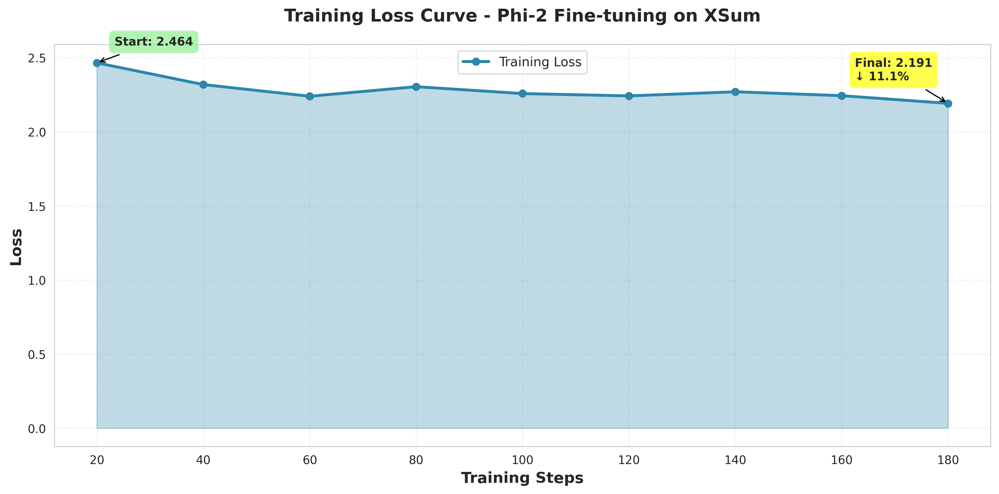

# Fine-tuning Phi-2 for Text Summarization

[](https://www.python.org/downloads/)
[](https://pytorch.org/)
[](https://huggingface.co/)
[](https://opensource.org/licenses/MIT)

## 📌 Table of Contents

- [Project Overview](#-project-overview)
- [Team Information](#-team-information)
- [Dataset](#-dataset)
- [Model Architecture](#-model-architecture)
- [Results](#-results)
- [Repository Structure](#-repository-structure)
- [Installation](#-installation)
- [Usage](#-usage)
- [Key Features](#-key-features)
- [Evaluation Metrics](#-evaluation-metrics)
- [Acknowledgments](#-acknowledgments)

---

## 🎯 Project Overview

This repository contains a complete end-to-end implementation of **fine-tuning Microsoft's Phi-2** (a 2.7B parameter decoder-only Large Language Model) for **abstractive text summarization** using the **XSum dataset**. 

### Purpose
The main objective is to demonstrate practical knowledge of deep learning for Natural Language Processing (NLP) by:
- Fine-tuning a pre-trained decoder-only transformer model
- Implementing instruction-style prompting for summarization tasks
- Applying parameter-efficient fine-tuning techniques (LoRA/QLoRA)
- Conducting comprehensive evaluation using standard NLP metrics

### Task Description
In this project, we tackle **Task 3** from the Deep Learning Final Exam:
> Fine-tune a decoder-only LLM (Phi-2) to generate concise abstractive summaries using the XSum dataset. This task highlights instruction-style prompting, causal LM training, and generation control. XSum summaries are highly abstractive, so the model must learn to rewrite and compress information rather than extract sentences.

---

## 👥 Team Information

### Individual Information
- **Name**: [Your Full Name]
- **NIM**: [Your Student ID]
- **Class**: [Your Class]

### Group Information
- **Group Name**: [Group Name]
- **Group Members**:
  - [Member 1 Name] - [NIM] - Task 1
  - [Member 2 Name] - [NIM] - Task 2
  - [Your Name] - [Your NIM] - Task 3 ✅

---

## 📊 Dataset

### XSum (Extreme Summarization)
- **Source**: BBC news articles
- **Task**: Generate one-sentence abstractive summaries
- **Total Samples**: 226,711 articles
- **Samples Used**: 1,500 training samples, 150 test samples (optimized for Google Colab free tier)
- **Unique Characteristic**: Highly abstractive summaries requiring content rewriting rather than extraction

**Dataset Statistics:**
- Average document length: ~370 words
- Average summary length: ~21 words
- Compression ratio: ~17.6x

**Dataset Link**: [EdinburghNLP/xsum on Hugging Face](https://huggingface.co/datasets/EdinburghNLP/xsum)

---

## 🏗️ Model Architecture

### Base Model: microsoft/phi-2

**Model Specifications:**
- **Type**: Decoder-only Transformer (Causal Language Model)
- **Parameters**: 2.7 billion
- **Context Length**: 2048 tokens
- **Architecture**: GPT-style with optimized attention mechanisms
- **Training**: Pre-trained on diverse web data and code

### Fine-tuning Configuration

**Parameter-Efficient Fine-Tuning (PEFT) with QLoRA:**
- **Quantization**: 4-bit (NF4) for memory efficiency
- **LoRA Rank (r)**: 16
- **LoRA Alpha**: 32
- **LoRA Dropout**: 0.05
- **Target Modules**: `q_proj`, `k_proj`, `v_proj`, `dense`
- **Trainable Parameters**: ~0.7% of total parameters

**Training Hyperparameters:**
| Parameter | Value |
|-----------|-------|
| Epochs | 1 |
| Batch Size | 1 |
| Gradient Accumulation Steps | 8 |
| Effective Batch Size | 8 |
| Learning Rate | 2e-4 |
| Optimizer | paged_adamw_8bit |
| LR Scheduler | Cosine with warmup |
| Warmup Steps | 30 |
| Max Sequence Length | 512 tokens |
| FP16 Training | Enabled |

---

## 📈 Results

### Training Performance

| Metric | Value |
|--------|-------|
| Initial Loss | 2.464 |
| Final Loss | 2.190 |
| Loss Improvement | 11.2% |
| Training Time | ~30 minutes (on T4 GPU) |
| Total Steps | 188 |

**Training Loss Curve:**



### Evaluation Metrics (ROUGE Scores)

ROUGE (Recall-Oriented Understudy for Gisting Evaluation) scores measure the overlap between generated and reference summaries:

| Metric | Score | Description |
|--------|-------|-------------|
| **ROUGE-1** | [Your Score] | Unigram overlap |
| **ROUGE-2** | [Your Score] | Bigram overlap |
| **ROUGE-L** | [Your Score] | Longest common subsequence |
| **ROUGE-Lsum** | [Your Score] | LCS with sentence splitting |

> **Note**: Fill in your actual scores after running the evaluation notebook.

**ROUGE Scores Visualization:**


### Sample Predictions

**Example 1 (High Quality):**
- **Document**: "The full cost of damage in Newton Stewart, one of the areas worst affected..."
- **Reference**: "Clean-up operations continue across the Scottish Borders and Dumfries and Galloway after flooding caused by Storm Frank."
- **Generated**: "[Your model's output]"
- **ROUGE-L**: [Score]

> More examples available in `reports/sample_predictions.txt`

---
---

## 🚀 Installation

### Prerequisites
- Python 3.8 or higher
- CUDA-capable GPU (recommended: 12GB+ VRAM)
- Google Colab account (for free GPU access)

### Setup Instructions

1. **Clone the repository**
```bash
git clone https://github.com/[your-username]/finetuning-phi-2-text-summarization.git
cd finetuning-phi-2-text-summarization
Install dependencies

Option A: Using pip

bash
pip install -r requirements.txt
Option B: Using specific versions (recommended for reproducibility)

bash
# Downgrade datasets for XSum compatibility
pip uninstall datasets -y
pip install 'datasets==3.1.0' --force-reinstall --no-deps

# Install other packages
pip install transformers accelerate peft bitsandbytes trl rouge-score sentencepiece
Login to Hugging Face (optional, for model upload)

bash
huggingface-cli login
💻 Usage
Running in Google Colab (Recommended)
Open the notebook

Upload notebooks/phi2_xsum_finetuning.ipynb to Google Colab

Or open directly from GitHub using Colab's GitHub integration

Enable GPU

Runtime → Change runtime type → Hardware accelerator: T4 GPU

Run all cells sequentially

The notebook includes 20 cells covering the complete pipeline

Estimated runtime: ~1.5-2 hours for training + evaluation

Notebook Structure
Cells	Section	Description
1-2	Setup	Installation and imports
3	Authentication	Hugging Face login
4-5	Data Loading	Load and analyze XSum dataset
6-7	Model Setup	Load Phi-2 with quantization and LoRA
8	Preprocessing	Format data with instruction prompts
9-10	Training	Configure and train the model
11-12	Checkpointing	Save and visualize training results
13-14	Inference Setup	Prepare model for generation
15-17	Evaluation	Generate predictions and calculate ROUGE
18-19	Analysis	Qualitative analysis and save reports
20	Summary	Final results summary
Local Execution (Advanced)
If you have a local GPU setup:

bash
# Navigate to notebooks directory
cd notebooks

# Launch Jupyter
jupyter notebook phi2_xsum_finetuning.ipynb
✨ Key Features
1. Memory-Efficient Training
4-bit Quantization (QLoRA): Reduces memory footprint by 75%

Gradient Checkpointing: Trades computation for memory

Optimized for Colab Free Tier: Runs on T4 GPU with 15GB RAM

2. Instruction-Style Prompting
python
prompt_template = """### Instruction:
Summarize the following news article in one concise sentence.

### Article:
{article_text}

### Summary:
"""
This format helps the model understand the task structure.

3. Parameter-Efficient Fine-Tuning (PEFT)
Only 0.7% of parameters are trainable

Faster training: ~30 minutes vs several hours

Lower resource requirements: Fits in consumer GPUs

4. Comprehensive Evaluation
Automatic metrics: ROUGE-1, ROUGE-2, ROUGE-L

Qualitative analysis: Best and worst predictions

Visualization: Loss curves, score distributions

5. Production-Ready Pipeline
Modular code structure

Detailed documentation

Reproducible results

Model checkpointing

📊 Evaluation Metrics
ROUGE Scores Explained
ROUGE-1: Measures unigram (single word) overlap

Higher score = More content words are preserved

ROUGE-2: Measures bigram (two consecutive words) overlap

Higher score = Better phrase-level accuracy

ROUGE-L: Measures longest common subsequence

Higher score = Better sentence structure preservation

ROUGE-Lsum: ROUGE-L with sentence-level splitting

Better for multi-sentence summaries

Interpretation
ROUGE-1 Score	Quality
< 0.20	Poor
0.20 - 0.35	Fair
0.35 - 0.45	Good
> 0.45	Excellent
XSum is known for low ROUGE scores due to its highly abstractive nature. Scores around 0.25-0.35 are considered good.

🔧 Troubleshooting
Common Issues
1. Out of Memory (OOM) Error

Reduce batch size or dataset size in Cell 4

Ensure gradient checkpointing is enabled

Use smaller max sequence length (512 instead of 1024)

2. Dataset Loading Error

bash
# Solution: Downgrade datasets library
pip uninstall datasets -y
pip install 'datasets==3.1.0' --force-reinstall --no-deps
3. Slow Training

Verify GPU is enabled in Colab (Runtime → Change runtime type)

Check torch.cuda.is_available() returns True

Reduce dataset size for faster iteration

4. Model Not Generating Properly

Ensure use_cache=True is set for inference

Check generation parameters (temperature, top_p)

Verify prompt format matches training format
