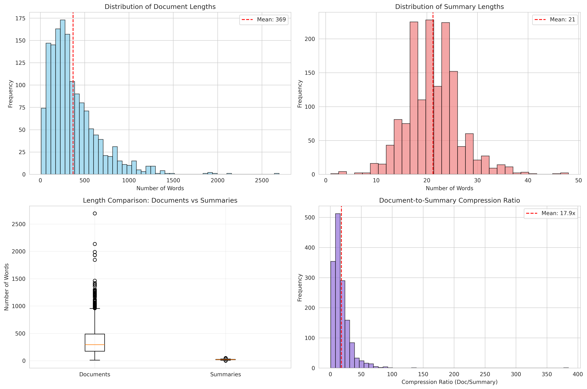

<div align="center">

# 📝 Fine-tuning Phi-2 for Text Summarization

### Task 3 - UAS Deep Learning: Decoder-Only LLM with LoRA

[](https://www.python.org/)
[](https://pytorch.org/)
[](https://huggingface.co/)
[](https://huggingface.co/microsoft/phi-2)

**Abstractive Text Summarization dengan Parameter-Efficient Fine-tuning (LoRA)**

[🎯 Overview](#-overview) • [📊 Results](#-results) • [🚀 Quick Start](#-quick-start) • [📖 Documentation](#-documentation)

---


</div>

---

## 📋 Table of Contents

- [Overview](#-overview)
- [Team Information](#-team-information)
- [Model Architecture](#-model-architecture)
- [Dataset](#-dataset)
- [Methodology](#-methodology)
- [Results](#-results)
- [Visualizations](#-visualizations)
- [Quick Start](#-quick-start)
- [Repository Structure](#-repository-structure)
- [Technical Details](#-technical-details)
- [Key Learnings](#-key-learnings)
- [References](#-references)

---

## 🎯 Overview

Repository ini berisi implementasi **Task 3** dari UAS Deep Learning yang berfokus pada **fine-tuning Phi-2** (decoder-only LLM dengan 2.7B parameters) untuk task **Abstractive Text Summarization** menggunakan dataset **XSum**.

### Apa yang Unik dari Task Ini?

| Aspect | Task 1 & 2 | Task 3 (Phi-2) |
|:------:|:----------:|:--------------:|
| **Architecture** | Encoder / Encoder-Decoder | **Decoder-only (LLM)** |
| **Model Size** | 109M - 223M | **2.7B parameters** |
| **Fine-tuning** | Full fine-tuning | **LoRA (0.3% params)** |
| **Quantization** | None | **4-bit (QLoRA)** |
| **Memory** | Standard | **Optimized for consumer GPU** |

### 🎯 Learning Objectives

1. ✅ **Fine-tune decoder-only LLM** (Phi-2) untuk text generation
2. ✅ **Implement LoRA** untuk parameter-efficient fine-tuning
3. ✅ **Apply 4-bit quantization** untuk memory efficiency
4. ✅ **Use instruction-style prompting** untuk summarization
5. ✅ **Evaluate** dengan ROUGE metrics
6. ✅ **Optimize** untuk Google Colab Free Tier (T4 GPU)

---

## 👥 Team Information

<table>
<tr>
<td><b>📚 Course</b></td>
<td>Deep Learning - Final Term Project</td>
</tr>
<tr>
<td><b>📝 Task</b></td>
<td>Task 3 - Fine-tuning Decoder-Only LLM for Summarization</td>
</tr>
</table>

### Group Members

| Name | NIM | Class |
|:-----|:---:|:-----:|
| Raihan Salman Baehaqi | 1103220180 | TK-46-02 |
| Jaka Kelana Wijaya | 1103223048 | TK-46-02 |

---

## 🏗️ Model Architecture

### Phi-2: Decoder-Only LLM

<div align="center">

```
┌─────────────────────────────────────────────────────────────────┐
│                  DECODER-ONLY ARCHITECTURE                       │
├─────────────────────────────────────────────────────────────────┤
│                                                                  │
│   Input: "### Article:\n{document}\n\n### Summary:\n"           │
│                              │                                   │
│                              ▼                                   │
│          ┌───────────────────────────────────┐                  │
│          │        PHI-2 DECODER              │                  │
│          │       (32 Transformer Layers)     │                  │
│          │                                   │                  │
│          │   ┌─────────────────────────┐    │                  │
│          │   │   Self-Attention        │    │  ← Causal Mask   │
│          │   │   (with LoRA adapters)  │    │    (左→右 only)  │
│          │   └─────────────────────────┘    │                  │
│          │              │                    │                  │
│          │   ┌─────────────────────────┐    │                  │
│          │   │   Feed-Forward Network  │    │                  │
│          │   └─────────────────────────┘    │                  │
│          │              │                    │                  │
│          │           × 32 layers             │                  │
│          └───────────────────────────────────┘                  │
│                              │                                   │
│                              ▼                                   │
│              Output: "Summary text..." (Autoregressive)         │
│                                                                  │
└─────────────────────────────────────────────────────────────────┘
```

</div>

### Model Specifications

| Property | Value |
|:---------|:------|
| **Model** | `microsoft/phi-2` |
| **Developer** | Microsoft Research |
| **Type** | Decoder-only Transformer (Causal LM) |
| **Total Parameters** | **2,780,428,288** (~2.78B) |
| **Trainable Parameters** | **8,421,376** (~8.4M) with LoRA |
| **Trainable %** | **0.30%** |
| **Hidden Size** | 2560 |
| **Layers** | 32 |
| **Attention Heads** | 32 |
| **Context Length** | 2048 tokens |
| **Vocabulary** | 51,200 tokens |

### LoRA Configuration

<div align="center">

```
┌─────────────────────────────────────────────────────────────┐
│                    LoRA MECHANISM                            │
├─────────────────────────────────────────────────────────────┤
│                                                              │
│   Original Weight Matrix W (2560 × 2560)                    │
│                     │                                        │
│         ┌──────────┴──────────┐                             │
│         │                     │                              │
│         ▼                     ▼                              │
│   ┌──────────┐         ┌──────────────┐                     │
│   │    W     │    +    │   ΔW = BA    │                     │
│   │ (frozen) │         │  (trainable) │                     │
│   └──────────┘         └──────────────┘                     │
│                              │                               │
│                    ┌────────┴────────┐                      │
│                    │                 │                       │
│                    ▼                 ▼                       │
│              ┌─────────┐      ┌─────────┐                   │
│              │ A (r×d) │  →   │ B (d×r) │                   │
│              │  Down   │      │   Up    │                   │
│              └─────────┘      └─────────┘                   │
│                                                              │
│   r = 16 (low rank) → 8.4M params instead of 2.78B         │
│                                                              │
└─────────────────────────────────────────────────────────────┘
```

</div>

| Parameter | Value | Description |
|:----------|:------|:------------|
| **Rank (r)** | 16 | Dimension of low-rank decomposition |
| **Alpha (α)** | 32 | Scaling factor |
| **Scaling** | α/r = 2 | Applied to LoRA output |
| **Target Modules** | q_proj, k_proj, v_proj, dense | Attention layers |
| **Dropout** | 0.05 | Regularization |
| **Bias** | none | No bias training |

### Why LoRA + Quantization?

| Technique | Benefit | Memory Saving |
|:----------|:--------|:-------------:|
| **LoRA** | Train only 0.3% parameters | ~99% |
| **4-bit Quantization** | Compress weights from FP16 to INT4 | ~75% |
| **Gradient Checkpointing** | Trade compute for memory | ~30% |
| **Combined** | Run 2.7B model on T4 GPU (16GB) | ✅ |

---

## 📊 Dataset

### XSum (Extreme Summarization)

<div align="center">



</div>

### Dataset Statistics

| Split | Original | Used | Percentage |
|:-----:|:--------:|:----:|:----------:|
| **Train** | 204,045 | **1,500** | 0.7% |
| **Test** | 11,334 | **150** | 1.3% |
| **Total** | 226,711 | **1,650** | ~0.7% |

### Why Small Subset?

| Constraint | Reason |
|:-----------|:-------|
| **GPU Memory** | Phi-2 (2.7B) requires significant VRAM |
| **Training Time** | Full dataset would take days |
| **Colab Limits** | Free tier has session timeouts |
| **Educational** | Sufficient to demonstrate pipeline |

### Dataset Characteristics

| Property | Value |
|:---------|:------|
| **Source** | BBC News articles |
| **Summary Style** | One-sentence, highly abstractive |
| **Avg Document** | ~430 words |
| **Avg Summary** | ~23 words |
| **Compression** | ~18:1 ratio |
| **Challenge** | Requires paraphrasing, not extraction |

### Input Format (Instruction-style)

```python
prompt_template = """### Article:
{document}

### Summary:
{summary}"""
```

---

## 🔧 Methodology

### Training Pipeline

```
┌──────────────────────────────────────────────────────────────────┐
│               PHI-2 SUMMARIZATION PIPELINE                        │
├──────────────────────────────────────────────────────────────────┤
│                                                                   │
│  1. 📥 Load XSum Dataset (1,500 train / 150 test)                │
│         │                                                         │
│         ▼                                                         │
│  2. 🔄 Format with Instruction Prompt Template                   │
│         │   "### Article:\n{doc}\n\n### Summary:\n{sum}"         │
│         ▼                                                         │
│  3. 🤖 Load Phi-2 with 4-bit Quantization (QLoRA)                │
│         │   BitsAndBytesConfig(load_in_4bit=True)                │
│         ▼                                                         │
│  4. ⚙️  Apply LoRA Adapters (r=16, α=32)                          │
│         │   Only 8.4M / 2.78B parameters trainable               │
│         ▼                                                         │
│  5. 🔤 Tokenize with Phi-2 Tokenizer                             │
│         │   max_length=512                                        │
│         ▼                                                         │
│  6. 🏋️ Train with SFTTrainer (1 epoch)                           │
│         │   Supervised Fine-Tuning on instruction data           │
│         ▼                                                         │
│  7. 📊 Generate Summaries & Compute ROUGE                        │
│         │                                                         │
│         ▼                                                         │
│  8. 💾 Save LoRA Adapters & Generate Report                      │
│                                                                   │
└──────────────────────────────────────────────────────────────────┘
```

### Training Configuration

| Parameter | Value | Rationale |
|:----------|:------|:----------|
| **Epochs** | 1 | Time constraint (Colab) |
| **Batch Size** | 1 | GPU memory limit |
| **Gradient Accumulation** | 8 | Effective batch = 8 |
| **Learning Rate** | 2e-4 | Standard for LoRA |
| **Optimizer** | paged_adamw_8bit | Memory efficient |
| **LR Scheduler** | Cosine | Smooth decay |
| **Warmup Steps** | 30 | Prevent early divergence |
| **Max Sequence** | 512 tokens | Balance quality vs memory |
| **FP16** | ✅ Enabled | Mixed precision training |
| **Gradient Checkpointing** | ✅ Enabled | Memory optimization |

---

## 📈 Results

### Training Performance

<div align="center">


</div>

| Metric | Value |
|:------:|:-----:|
| **Initial Loss** | 2.4634 |
| **Final Loss** | 2.1901 |
| **Improvement** | **11.09%** |
| **Total Steps** | 180 |
| **Training Time** | ~1.5-2 hours |

### ROUGE Evaluation Metrics

<div align="center">


</div>

| Metric | Score | Description |
|:------:|:-----:|:------------|
| **ROUGE-1** | **7.13%** | Unigram overlap |
| **ROUGE-2** | **0.21%** | Bigram overlap |
| **ROUGE-L** | **6.03%** | Longest common subsequence |

### Performance Analysis

| Aspect | Status | Notes |
|:------:|:------:|:------|
| **Training Convergence** | ✅ Good | Loss decreased consistently |
| **ROUGE Scores** | ⚠️ Low | Expected with 1 epoch, small data |
| **LoRA Efficiency** | ✅ Excellent | Only 0.3% params trained |
| **Memory Usage** | ✅ Efficient | Runs on T4 GPU (16GB) |

### Why Low ROUGE Scores?

| Factor | Impact | Solution |
|:-------|:------:|:---------|
| **Only 1 Epoch** | High | Train for 3-5 epochs |
| **Tiny Dataset** (1.5K) | High | Use full XSum (204K) |
| **XSum Difficulty** | Medium | Highly abstractive summaries |
| **No Beam Search** | Low | Use beam_size > 1 |

### Benchmark Comparison

| Model | ROUGE-1 | ROUGE-2 | ROUGE-L | Data |
|:------|:-------:|:-------:|:-------:|:----:|
| PEGASUS | 47.21 | 24.56 | 39.25 | 100% |
| BART-large | 45.14 | 22.27 | 37.25 | 100% |
| T5-large | 43.52 | 21.55 | 36.69 | 100% |
| **Phi-2 (Ours)** | **7.13** | **0.21** | **6.03** | **0.7%** |

> ⚠️ **Note:** Our scores are significantly lower due to using only 0.7% of training data and 1 epoch. This demonstrates the trade-off between resources and performance.

---

## 🖼️ Visualizations

### Training Visualization

<div align="center">

| Training Loss | ROUGE Scores |
|:-------------:|:------------:|
|  |  |

</div>

### Dataset Analysis

<div align="center">


</div>

---

## 🚀 Quick Start

### Option 1: Google Colab (Recommended) ⭐

1. **Upload notebook ke Google Colab**

2. **Enable GPU Runtime:**
   ```
   Runtime → Change runtime type → GPU (T4)
   ```

3. **Install dependencies (Cell 1):**
   ```python
   !pip install transformers accelerate peft bitsandbytes trl
   !pip install rouge-score sentencepiece datasets
   ```

4. **Run all cells:**
   ```
   Runtime → Run all (Ctrl+F9)
   ```

### Option 2: Local Setup

```bash
# 1. Clone repository
git clone https://github.com/[username]/finetuning-phi-2-text-summarization.git
cd finetuning-phi-2-text-summarization

# 2. Create virtual environment
python -m venv venv
source venv/bin/activate  # Linux/Mac
# venv\Scripts\activate   # Windows

# 3. Install dependencies
pip install torch transformers accelerate peft bitsandbytes
pip install trl rouge-score sentencepiece datasets
pip install matplotlib seaborn pandas jupyter

# 4. Run Jupyter
jupyter notebook notebooks/finetuning-phi-2-text-summarization.ipynb
```

### Hardware Requirements

| Component | Minimum | Recommended |
|:----------|:--------|:------------|
| **GPU** | T4 (16GB) | A100 (40GB) |
| **RAM** | 12GB | 16GB+ |
| **Storage** | 10GB | 20GB |
| **Platform** | Google Colab | Local/Cloud |

---

## 📁 Repository Structure

```
finetuning-phi-2-text-summarization/
│
├── 📄 README.md                          ← You are here!
│
├── 📓 notebooks/
│   └── finetuning-phi-2-text-summarization.ipynb  # Main notebook
│
└── 📊 reports/
    ├── 📄 report_phi2_summarization.md   # Detailed report
    ├── 📄 sample_predictions.txt         # Example outputs
    ├── 📄 all_predictions.csv            # All test predictions
    ├── 🖼️ dataset_analysis.png           # Dataset visualization
    ├── 🖼️ training_loss.png              # Loss curve
    ├── 🖼️ Rouge_Scores.png               # ROUGE metrics
    └── 🖼️ Screenshot 2026-01-12...png    # Additional visualization
```

---

## 🔬 Technical Details

### 4-bit Quantization Configuration

```python
from transformers import BitsAndBytesConfig

bnb_config = BitsAndBytesConfig(
    load_in_4bit=True,              # Enable 4-bit loading
    bnb_4bit_quant_type="nf4",      # NormalFloat4 quantization
    bnb_4bit_compute_dtype=torch.float16,  # Compute in FP16
    bnb_4bit_use_double_quant=True, # Double quantization
)
```

### LoRA Configuration

```python
from peft import LoraConfig

lora_config = LoraConfig(
    r=16,                           # Low-rank dimension
    lora_alpha=32,                  # Scaling factor
    target_modules=[                # Modules to adapt
        "q_proj", "k_proj", 
        "v_proj", "dense"
    ],
    lora_dropout=0.05,              # Dropout for regularization
    bias="none",                    # No bias training
    task_type="CAUSAL_LM"           # Causal language modeling
)
```

### Prompt Template

```python
def format_prompt(document, summary=None):
    prompt = f"""### Article:
{document}

### Summary:
"""
    if summary:
        prompt += summary
    return prompt
```

### Generation Function

```python
def generate_summary(document, model, tokenizer, max_length=100):
    prompt = format_prompt(document)
    
    inputs = tokenizer(prompt, return_tensors="pt").to(device)
    
    with torch.no_grad():
        outputs = model.generate(
            **inputs,
            max_new_tokens=max_length,
            num_beams=4,
            do_sample=False,
            early_stopping=True,
            pad_token_id=tokenizer.eos_token_id
        )
    
    # Extract only generated part
    generated = tokenizer.decode(outputs[0], skip_special_tokens=True)
    summary = generated.split("### Summary:\n")[-1].strip()
    
    return summary
```

### ROUGE Computation

```python
from rouge_score import rouge_scorer

scorer = rouge_scorer.RougeScorer(
    ['rouge1', 'rouge2', 'rougeL', 'rougeLsum'],
    use_stemmer=True
)

def compute_rouge(predictions, references):
    scores = {k: [] for k in ['rouge1', 'rouge2', 'rougeL', 'rougeLsum']}
    
    for pred, ref in zip(predictions, references):
        result = scorer.score(ref, pred)
        for key in scores:
            scores[key].append(result[key].fmeasure)
    
    return {k: np.mean(v) for k, v in scores.items()}
```

---

## 💡 Key Learnings

### 1. LoRA: Parameter-Efficient Fine-tuning

```python
# Full fine-tuning: 2.78B parameters
# LoRA fine-tuning: 8.4M parameters (0.3%)

# Savings:
trainable_ratio = 8.4M / 2780M = 0.30%
memory_savings = ~99%
```

### 2. Instruction-style Prompting

```python
# Generic prompt (bad)
"Summarize: {document}"

# Instruction prompt (better)
"""### Article:
{document}

### Summary:
"""
# → Clearer structure for the model to follow
```

### 3. Decoder-only vs Encoder-Decoder

| Aspect | Encoder-Decoder (T5) | Decoder-only (Phi-2) |
|:-------|:---------------------|:---------------------|
| **Input Processing** | Bidirectional | Left-to-right only |
| **Output** | Separate decoder | Same model generates |
| **Training** | Seq2Seq loss | Causal LM loss |
| **Memory** | Two components | Single component |
| **Best For** | Structured tasks | Open-ended generation |

### 4. Memory Optimization Stack

```
┌─────────────────────────────────────────┐
│         MEMORY OPTIMIZATION             │
├─────────────────────────────────────────┤
│  1. 4-bit Quantization     → 75% saved  │
│  2. LoRA Adapters          → 99% saved  │
│  3. Gradient Checkpointing → 30% saved  │
│  4. Mixed Precision (FP16) → 50% saved  │
├─────────────────────────────────────────┤
│  Result: 2.7B model runs on 16GB GPU!   │
└─────────────────────────────────────────┘
```

---

## 🔮 Potential Improvements

| Improvement | Expected Impact | Difficulty |
|:------------|:---------------:|:----------:|
| **More epochs (3-5)** | +10-15% ROUGE | ⭐ Easy |
| **Full XSum dataset** | +20-30% ROUGE | ⭐⭐ Medium |
| **Larger LoRA rank (r=32)** | +3-5% ROUGE | ⭐ Easy |
| **Beam search tuning** | +2-3% ROUGE | ⭐ Easy |
| **Better prompt engineering** | +5-10% ROUGE | ⭐ Easy |
| **Use Phi-3 or Llama** | +5-10% ROUGE | ⭐⭐ Medium |

---

## 📚 References

1. Microsoft Research. (2023). **"Phi-2: The surprising power of small language models"**
2. Hu, E., et al. (2021). **"LoRA: Low-Rank Adaptation of Large Language Models"**
3. Narayan, S., et al. (2018). **"Don't Give Me the Details, Just the Summary! Topic-Aware Convolutional Neural Networks for Extreme Summarization"** (XSum)
4. HuggingFace PEFT Documentation
5. HuggingFace TRL (Transformer Reinforcement Learning) Library

---

## 📜 License

This project is created for **educational purposes** as part of Deep Learning course final exam (UAS) at Telkom University.

---

<div align="center">

### ⭐ Star this repository if you found it helpful!

**Part of UAS Deep Learning - Task 3**

*Fine-tuning Decoder-Only LLM with Parameter-Efficient Methods*


-blue?style=for-the-badge)
-orange?style=for-the-badge)

</div>
